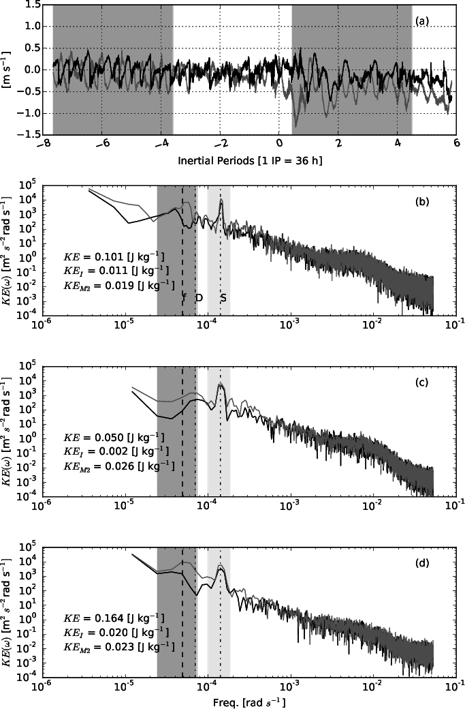
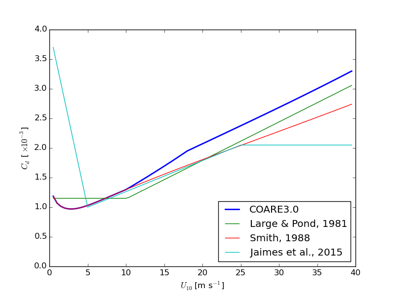
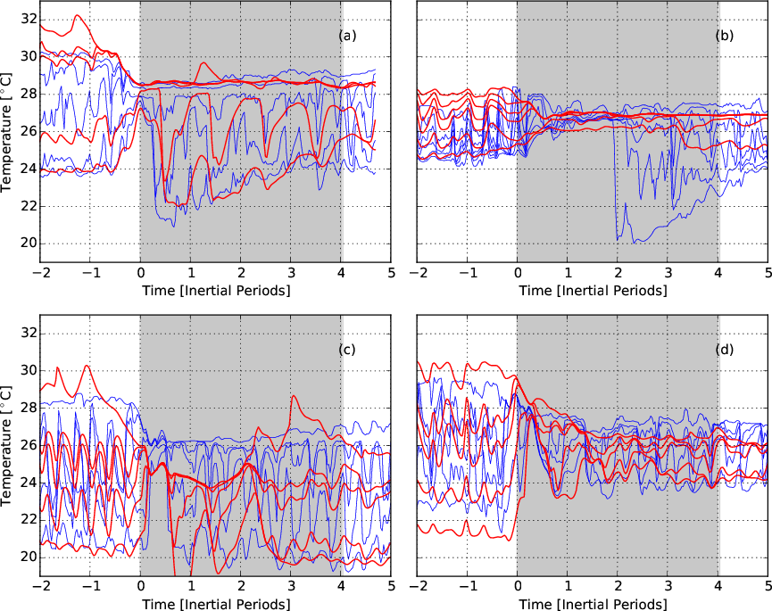
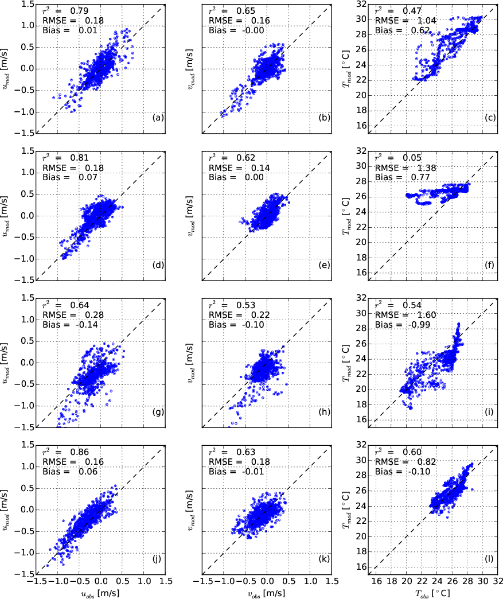
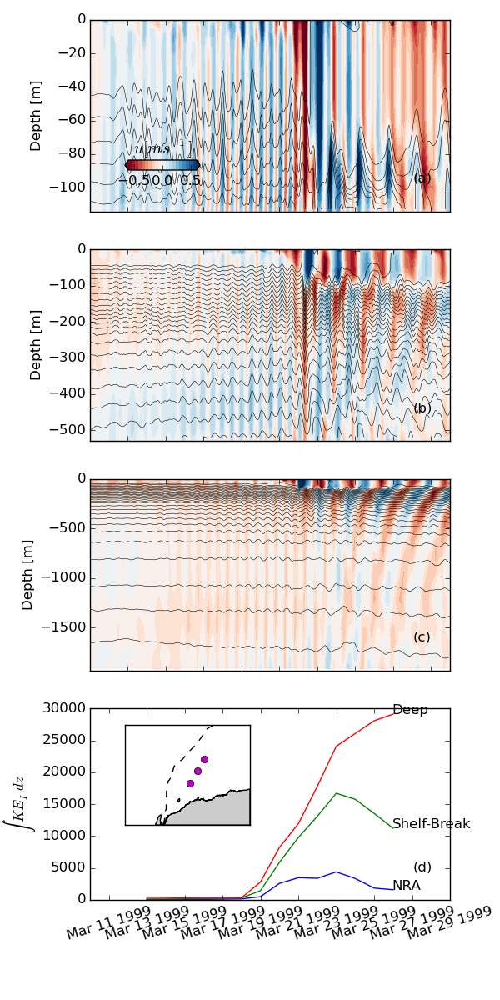
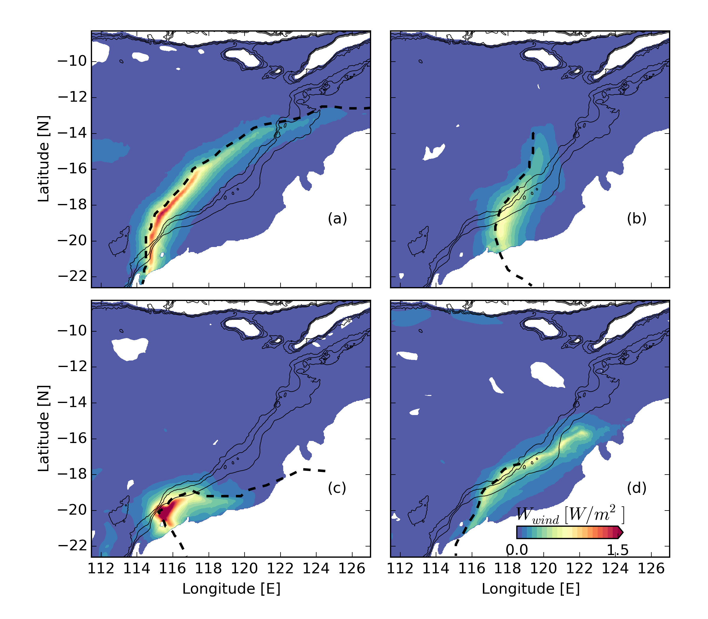
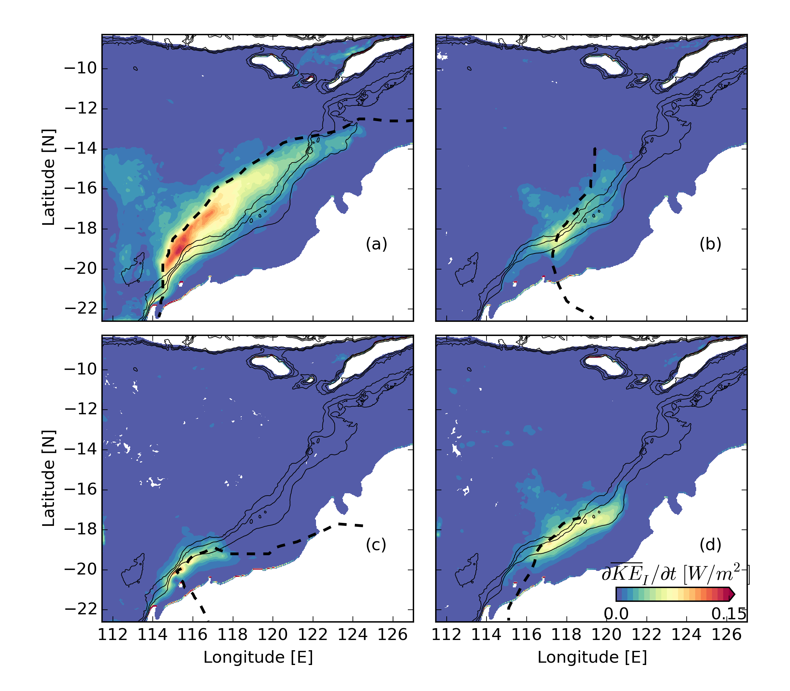
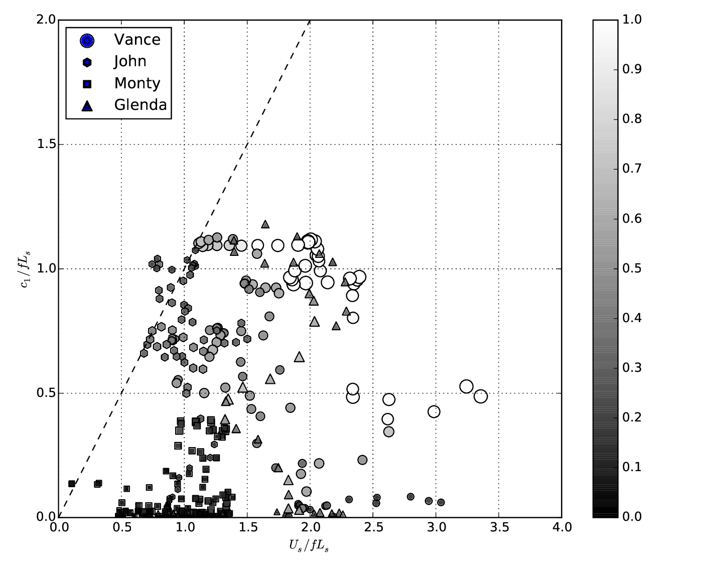
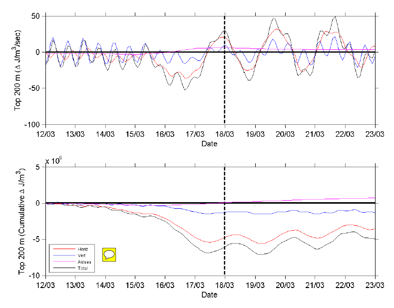
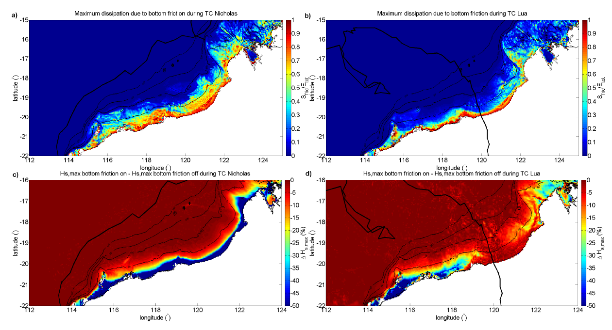

% Near-inertial ocean response to tropical cyclone forcing
% $^1$Matt Rayson, Greg Ivey, Nicole Jones, Ryan Lowe, $^2$Geoff Wake, $^3$Jason McConnochie
% *$^1$University of Western Australia*, *$^2$Woodside Energy Ltd*, $^3$*Shell Global Solutions*

---

# Study Overview

 - Analyse TC response at North Rankin A

 - Run ROMS and evaluate performance for historical storms

 - Determine the dominant ocean response (near-inertial motions)

 - Quantify energy flux into ocean

 - Determine relationship to governing parameters

---

## Simple wind-driven ocean model

$$
\frac{du}{dt}-fv= 	\frac{\tau_x}{h_{mix} \rho}-ru  \\
\frac{dv}{dt}+fu=	\frac{\tau_y}{h_{mix} \rho}-rv   
$$

Solution for constant wind that is switched off:
$$
\tilde{u} =u_0 e^{-ift-rt}
$$
  **Inertial oscillations** 

---

## Linear ocean response to a TC

How much energy is transferred into the ocean?

$$
P=  \Gamma\frac{\rho u_{*max}^4 L_s^2}{fh_{mix}} G\left(\frac{c_1}{fL_s} ,\frac{U_s}{fL_s}\right)
$$

Important parameters:
 
> - Free-wave Rossby number: $\frac{c_1}{fL_s}$

> - Storm Rossby number: $\frac{U_s}{fL_s}$

---

## Historical TCs @ NRA
  
**Four category 4/5 (BoM definition) between 1999 - 2006:**

1. TC Vance: March 1999
2. TC John: December 1999
3. TC Monty: February 2004
4. TC Glenda: March 2006

---

## Near-inertial ocean response

**Rotary spectral analysis:**

- (TC Glenda example)
- Post-storm currents 0.5 - 1.5 m/s
- Peak in CCW spectra (gray)
- Integral gives KE 
$$
KE_I=1/2 \int_{0.5f}^{1.5f} \hat{S}~d\omega
$$

**->Peak near $f$ following 4 TCs**

---

## ROMS Model Overview

- Regional Ocean Modelling System
- 4 km Aus-Indo Basin grid

Inputs:

- HYCOM Global
- TPXO Tides
- CFSR atmosphere
- *CycWind* blended fields

---

## ROMS Air-Sea Parameterisation

COARE3.0 Algorithm

---

<video width="800" height="600" controls>
   <source src="FIGURES/Vance_4km_T_z100m.mp4" type="video/mp4">
</video> 

---

## Water temperature response

Red: model

Blue: observed

---

<OBJECT data="Figure9_mpld3.html" width="800" height="580" >
Warning: file_to_include.html could not be included.
</OBJECT>

---

## Model validation quantities

 - root mean squared error (RMSE)
$$
RMSE = \sqrt{\frac{1}{N} \sum\left[ X_{obs} - X_{mod} \right]^2 }
$$
 - correlation coefficient (CC)
$$
CC = \frac{1}{N} \frac{\sum\left( X_{obs} - \bar{X}_{obs}\right) \left( X_{mod} - \bar{X}_{mod}\right)}{\sigma_{obs}\sigma_{mod}} 
$$
 - bias (mean error)
$$
Bias = \frac{1}{N} \sum\left( X_{mod} - {X}_{obs}\right) 
$$

---

**Validation statistics**

---

## Uncertainty sources

(Ranked)

1) Storm track & structure

2) Background ocean state (T, S, vorticity ($\zeta$))

3) Wind drag parameterisation

4) Heat flux parameterisation

5) Model resolution

Ref: *Halliwell et al., 2011, MWR*

---

## Near-inertial (NI) oscillations

 - Eastward velocity (z-t) show NI signature

 Significance:

 >- Shear at base of mixed layer drives vertical mixing
 >- When $\omega>f$ --> vertical energy propagation
 >- Dominates ocean variability post-storm i.e., large velocities
 >- Large length and time scales means higher integrated work done on the seabed
 >- Increased seabed shear: potentially increased sediment transport

---

##How much energy is transferred into the ocean?

$$
\int_A \frac{\partial }{\partial t} (\overline{KE}_i)\ dA	\approx \int_A~\mathbf{\vec{\tau}\cdot u}\ dA
$$

 - NI Kinetic Energy: $\overline{KE}_i(x,~y)= \int\limits_{-H}^{\eta} KE_I(x,~y,~z)~dz $

 - Wind Work:  $\vec{\tau}\cdot \mathbf{u}$

---

## Wind Work

---

## Near-Inertial Kinetic Energy

---

## How much energy is transferred into the ocean?

----------------------------------------------------------------------
TC           Wind        KE     KE_I   KE_M2   Near-inertial  Ratio   
Name         work [GW]   [GW]   [GW]   [GW]    efficiency     KE_I/KE 
----------- ----------- ------ ------ ------- -------------- ---------
TC Vance     117         25     12     9       10 %           50 %    

TC John      58          11     3      4       5 %            25 %    

TC Monty     63          3      1      3       2 %            47 %    

TC Glenda    56          14     4      8       7 %            26 %    
----------------------------------------------------------------------

 - 1 - 2 GW to generate internal tide on entire NWS

---

$$
\hat{P} = \frac{\partial\overline{KE}_{I}/\partial t}{\rho_0 u_*^4/(f h_{mix})}
$$

---

$$
\hat{P} = \frac{\partial\overline{KE}_{I}/\partial t}{\rho_0 u_*^4/(f h_{mix})}
$$
<OBJECT data="Figure16_mpld3.html" width="620" height="580" align='right'>
Warning: file_to_include.html could not be included.
</OBJECT>

---

# Seabed effects

Inertial decay time-scale, $\tau_d$:
$$
\overline{KE}_I(t)=KE_0 e^{-t/\tau_d }
$$

---

# Other work: Heat Budget

Helen MacDonald

---

# Other work: Surface wave modelling

Edwin Drost

---

# Summary

 >- Near-inertial (NI) oscillations develop in the wake of each TC

 >- Dominate ocean current variability post-TC

 >- NI Energy input dependent on storm and free-wave Rossby numbers ($U_s/fL_s$, $c_1/fL_s$)

 >- 2 - 10 % of wind work goes into NI kinetic energy

 >- NI decay time-scale is depth-dependent

 >- Gives us a general predictive capability to classify TC response based on track and parameters

---

# Avenues for further research

 - Drivers of near-inertial energy decay

 - Mixed layer restratification processes (currently sub-grid scale)

 - Effects of wave-current interactions on bed friction

 - Application to sediment transport

---

**Acknowledgements:**

This work is funded by the Australian Research Council Linkage Project LP110100017, with Woodside Energy Ltd as the industry partner.

**Reference:**

Rayson, M. D., G. N. Ivey, N. L. Jones, R. Lowe, G. W. Wake and J. D. McChonochie (2015), Near-inertial ocean response to tropical cyclone forcing on the Australian North-West Shelf, *J. Geophys. Res.*

**Contact:**

    matt.rayson@gmail.com
    greg.ivey@uwa.edu.au
    nicole.jones@uwa.edu.au

## Thank you

