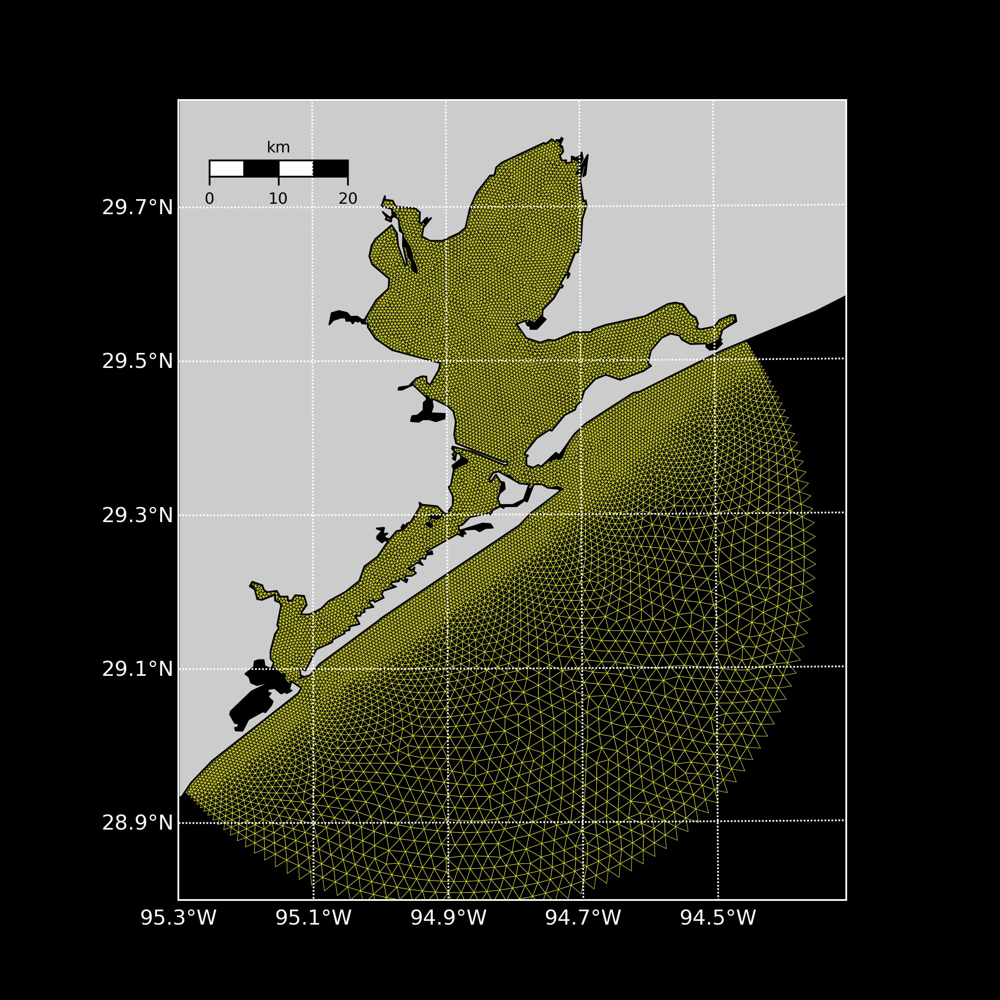

<!--[Oil Spill Modelling](#oil-spill)

[Estuarine circulation in Galveston Bay, Texas](#estuarine-circulation-in-galveston-bay)

[Ocean response to tropical cyclone forcing](#ocean-response-to-tropical-cyclones)

[Internal wave dynamics near complex topography](#internal-wave-dynamics-near-complex-topography)

## Oil Spill Modelling

**Collaborators:** Oliver Fringer (PI), Ed Gross (*Stanford University*), Ben Hodges (*Univ. of Texas*), Rob Hetland (*Texas A&M Univ.*)

Predicting the transport and fate of pollutants in the natural environment is an important application for numerical circulation models. We have applied the numerical model SUNTANS to investigate the transport pathways for oil and other tracers within the Gulf of Mexico nearshore bays. The main benefit for using a high-resolution 3D numerical model to simulate the transport is to reveal that dispersion is an inhomogeneous process and is enhanced near regions of complex topography - such as the constriction in the animation below - and/or in regions of strong baroclinicity. Numerical simulations like this can give a better estimate of defining regions susceptible to exposure to these pollutants. 

*Figure: Animation showing the release of a passive tracer in the SUNTANS model from the March 22nd 2014 barge spill site in Galveston Bay, TX. The tracer has an initial concentration of 1.0 and the color scale shows up to 1/1000th of the initial value. All times are in GMT. Note that since this tracer is passive, it does not behave exactly as oil would, in particular these are no buoyancy or weathering effects; there is no additional influence of wind stress on the plume. We maintain no guarantee as to the validity of these results. *

-->
# Internal wave dynamics near complex topography
**Collaborators:** Greg Ivey, Nicole Jones (*Univ. of Western Australia*)

Tides on the Australian North-West Shelf and the Indo-Australian Basin are generally
large in amplitude and their interaction with the shelf topography generates internal tides.
Observations and numerical modelling has revealed the ubiquity of these waves in this region - this
was the main topic of my PhD thesis and its subsequent [publications](Publications.md). 

<!--This animation of the high-passed filtered (150 km spatial filter) sea surface expression
from a 3D ocean model demonstrates the prevalence of these waves in the ocean.-->

<!-- <iframe width="480" height="360" src="https://www.youtube.com/embed/7DOCA_cUcYY" frameborder="0" allowfullscreen></iframe>-->
<iframe width="480" height="360" src="https://www.youtube.com/embed/T9jZW0B5js4" frameborder="0" allowfullscreen></iframe>

# Estuarine circulation in Galveston Bay

**Collaborators:** Oliver Fringer, Ed Gross (*Stanford University*)

We have developed a three-dimensional hydrodynamic model for Galveston Bay in Texas using the 
SUNTANS model. Estuaries in the Gulf of Mexico are generally shallow with complex shoreline 
geometries and entrances to the Gulf. The tides in the Gulf are micro-tidal (< 1 m tidal range) 
and therefore other processes such as wind stress, river discharge and surface heating and
cooling are important drivers of estuarine circulation.

<iframe width="480" height="360" src="https://www.youtube.com/embed/ttiHKM8DuzA" frameborder="0" allowfullscreen></iframe>

<!--
 

*SUNTANS triangular mesh grid*

We have used realistic forcing conditions to drive the model for a five year hind cast period. 
We have used the following sources to drive the model:

- Open boundary T/S/u/v: TAMU ROMS shelf model
- Tidal open boundaries: OSU Gulf of Mexico tidal inversion model
- Atmospheric fluxes: North American Regional Reanalysis (NARR)
- Rivers: USGS stream gauge data

The model is being evaluated using data from: NOAA, Texas Water Development Board and University of Texas. 

<iframe width="480" height="360" src="https://www.youtube.com/embed/yxHHC3UjTkQ" frameborder="0" allowfullscreen></iframe>

### Links:
- [GISR Website](http://gisr.tamu.edu/)
- [SUNTANS NetCDF output hosted on TAMU THREDDS server](http://pong.tamu.edu/thredds/catalog/mrayson_galveston/catalog.html)
- [Texas A&M ROMS Texas-Louisiana Shelf Model](http://barataria.tamu.edu/thredds/catalog/txla_nesting6/catalog.html)

-->

[Back to top](#top)
# Ocean response to tropical cyclone forcing
**Collaborators:** Greg Ivey, Ryan Lowe, Nicole Jones (*Univ. of Western Australia*)

<iframe width="560" height="315" src="https://www.youtube.com/embed/6DxF5ww2Vus" frameborder="0" allow="accelerometer; autoplay; encrypted-media; gyroscope; picture-in-picture" allowfullscreen></iframe>

[Back to top](#top)

