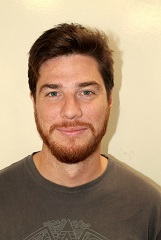

<!--  -->
 
<!-- !

 -->

<a itemprop="sameAs" content="https://orcid.org/0000-0002-6049-8600" href="https://orcid.org/0000-0002-6049-8600" target="orcid.widget" rel="noopener noreferrer" style="vertical-align:top;">orcid.org/0000-0002-6049-8600</a>

# Home

I am a [senior research fellow](https://research-repository.uwa.edu.au/en/persons/matt-rayson) at the [Oceans Graduate School, University of Western Australia](https://www.uwa.edu.au/ems/Schools/Oceans-Graduate-School).
 My research specialises in physical oceanography with an emphasis on numerical modelling and
observing stratified flows on the continental shelf and coastal regions. My main work focuses on the metocean component of the [ARC Industrial Transformation Research Hub for Offshore 
Floating Facilities](https://www.offshorehub.edu.au/). Previously, I was a postdoctoral scholar in the Bob and Norma Street Environmental Fluid Mechanics Laboratory at
Stanford University, where I developed numerical modelling tools to study the circulation in the bays and estuaries along the Gulf of Mexico coast. I am an active user and developer of the [SUNTANS](https://github.com/ofringer/suntans) unstructured grid ocean model.

My general research interests include:

- Tide-topography interactions including internal tide generation
- Storm-generated near-inertial waves
- Nonlinear internal waves
- Hydrodynamic modelling of coastal ocean and estuarine physics
- Transport processes in the coastal ocean
- Transitions to turbulence (e.g., breaking internal waves)
- Uncertainty quantification of ocean dynamical quantities
- Any time-dependent, dynamic problems!

See my [Research](Research.md) and [Internal Waves](internalwaves.md) pages for more details. 

**Figure: Flow streamlines of Galveston Bay. Published in the [Stanford Art of Science Competition](https://web.stanford.edu/group/mrs/cgi-bin/wordpress/art-of-science/aos-2013/).**

# News

- November 2018: I am currently on parental leave until mid-May 2019.

- November 2017: Check out our award winning video published in the [Gallery of Fluid Motion](https://gfm.aps.org/)!

<iframe width="480" height="360" src="https://www.youtube.com/embed/Q8DEwt11E64" frameborder="0" allow="autoplay; encrypted-media" allowfullscreen></iframe>

---

*Matthew D. Rayson, PhD*

*Senior Research Fellow*

*Oceans Graduate School and the Oceans Institute*

*University of Western Australia*

*matt dot rayson at gmail dot com*

<!-- Global site tag (gtag.js) - Google Analytics -->

