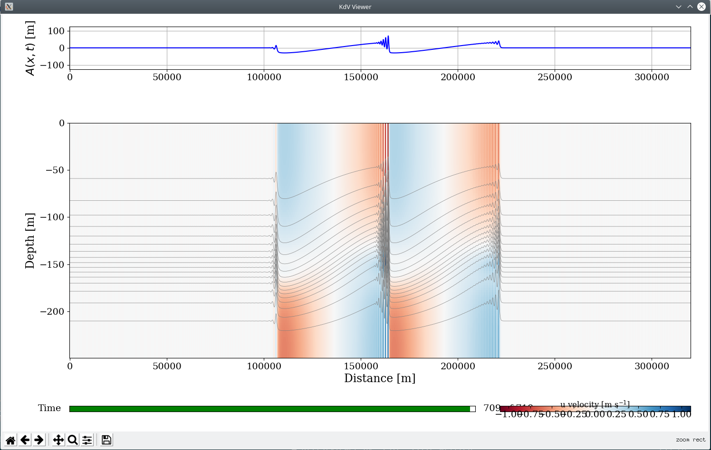

This page contains links to various resources for modelling and analysing oceanographic observations to understand internal waves.

--- 

# Internal Wave Climatology

We have created an internal tide climatological atlas for northern Australia using output from a 3D hydrostatic ocean model - SUNTANS. Ocean state variables (currently only density) were decomposed into tidal harmonic consituents and vertical normal modes to provide succinct maps of the internal tide amplitude for different time periods. 

<iframe width="771" height="514" src="https://www.youtube.com/embed/fvUI8mFfbic" frameborder="0" allow="accelerometer; autoplay; encrypted-media; gyroscope; picture-in-picture" allowfullscreen></iframe>

## Documentation

Currently, there is a [presentation describing the methodology](http://imos.org.au/fileadmin/user_upload/shared/IMOS%20General/ACOMO/ACOMO_2018/Powerpoints/Wednesday/Rayson_compressed.pdf) that I gave at the [Australian Coastal Ocean Modelling and Observation](http://imos.org.au/calendar/events/acomo/acomo2018/) workshop in Canberra, October 2018.

## Download

 - Gridded climatological atlas [netcdf file (~3GB)](https://cloudstor.aarnet.edu.au/plus/s/0YHxCbFJyRVoFiY)
 - GIS imagery of the semidiurnal, mode-one amplitude [geotiff files](https://cloudstor.aarnet.edu.au/plus/s/So11Y29m5BXwIIJ)

## Scripts [TBC]

*Several driver scripts and example notebooks will be put onto [github](https://github.com/mrayson) in the near future...*

---

# Weakly nonlinear internal wave (KdV) solver

Code for calculating numerical solutions to the Korteweg - de Vries (KdV) equation for internal gravity waves in a continuously stratified fluid is available on [bitbucket](https://bitbucket.org/mrayson).

## Code

 - [KdV solver code](https://bitbucket.org/mrayson/iwaves)
 - [Driver application for running the kdv model via command line with text file inputs](https://bitbucket.org/mrayson/run-kdvshelf)

---

# Ocean Modelling

I have developed several tools for the pre/post-processing of numerical model and
 oceanographic measurment data. The majority of these are written in python and are hosted on either [github](https://github.com/mrayson) or
 [bitbucket](https://bitbucket.org/mrayson). This includes:

- Python oceanographic data analysis toolbox [SODA](https://github.com/mrayson/soda)
- SUNTANS ocean model [github page](https://github.com/ofringer/suntans)
    - There is some documentation for setting up SUNTANS with python [here](http://suntanspy.readthedocs.io/en/latest/)

<!--
- Python [toolbox](http://sourceforge.net/p/suntans/code/HEAD/tree/python/) for the SUNTANS unstructured grid model.
- 3D unstructured grid visualisation in python using [Mayavi](http://docs.enthought.com/mayavi/mayavi/).
- MATLAB and python tools for setting up Regional Ocean Modeling System ([ROMS](http://www.myroms.org)) data
	-	See my [ROMS python module](http://sourceforge.net/p/suntans/code/HEAD/tree/python/DataIO/romsio.py). 
-->
<iframe width="480" height="360" src="https://www.youtube.com/embed/icbtv6PKj2g" frameborder="0" allowfullscreen></iframe>

